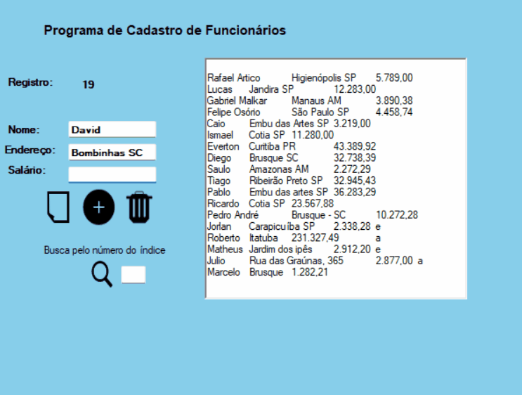

# CRUD C#

Atividade proposta na Etec de Embu, utilizando a linguagem C# como ferramente e também Windows Forms.

##📃 Mini Banco de Dados
O objetivo era criar utilizando Windows forms e C# um mini banco de dados, com as funções criar, ler, atualizar e excluir e além disso uma busca por registro.

## 🛠️Tecnologias

* C#
* Windows Forms
* SharpDevelop e Visual Studio

## 📞 Contato

pedrohgs2004@gmail.com  
Linkedin: https://www.linkedin.com/in/pedro-henrique-g-silva-a2100a23a/?originalSubdomain=br
